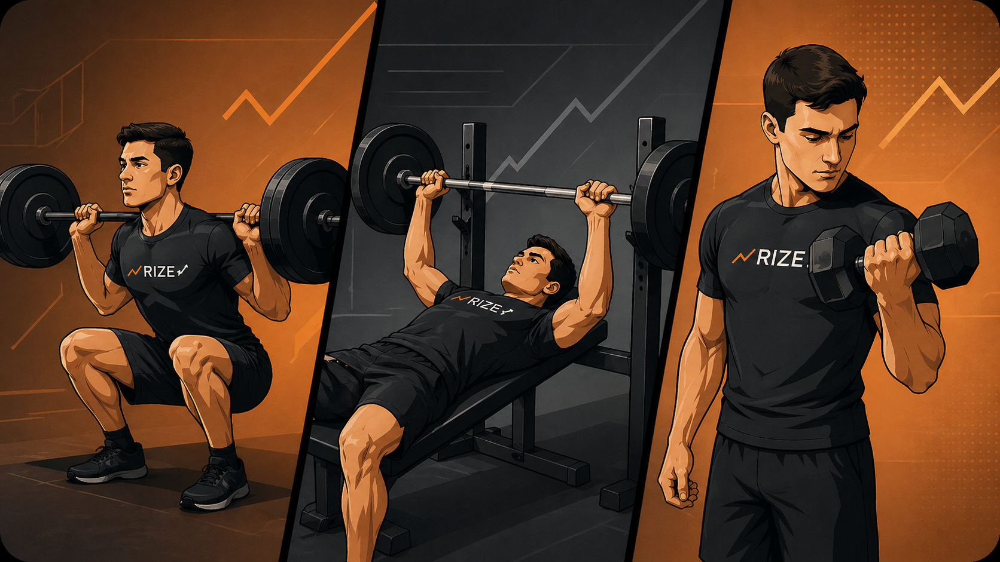
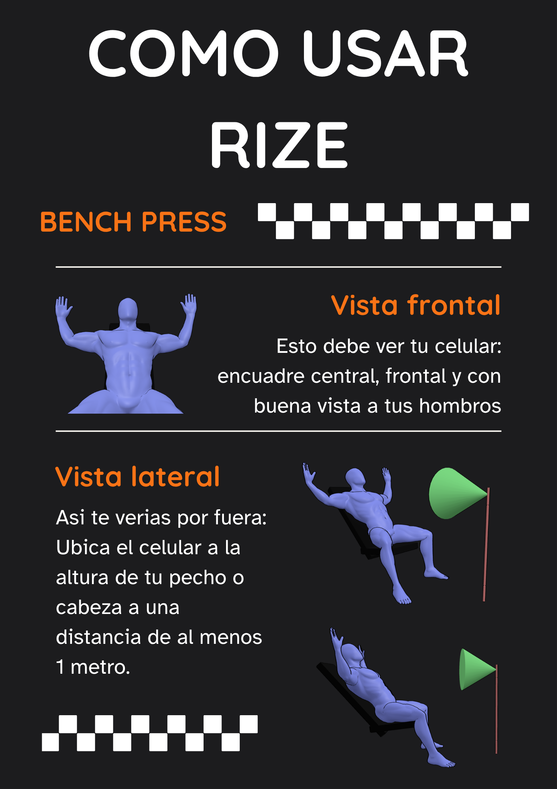
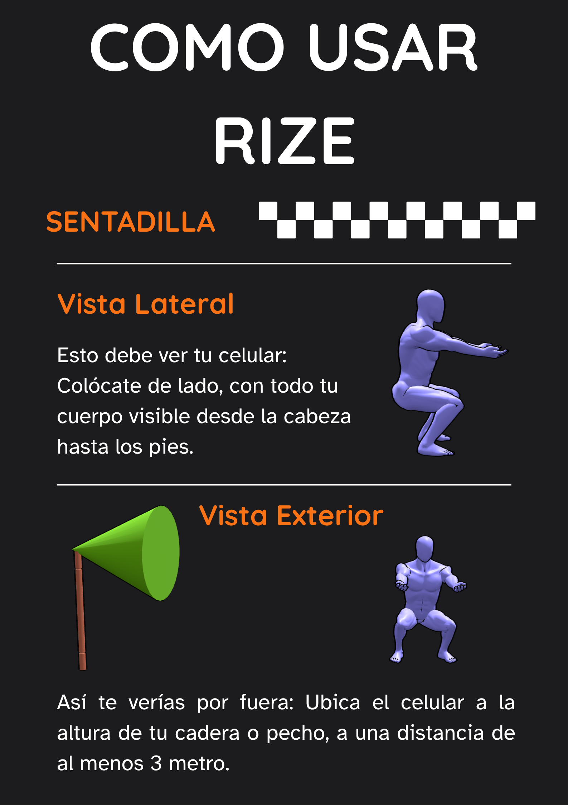
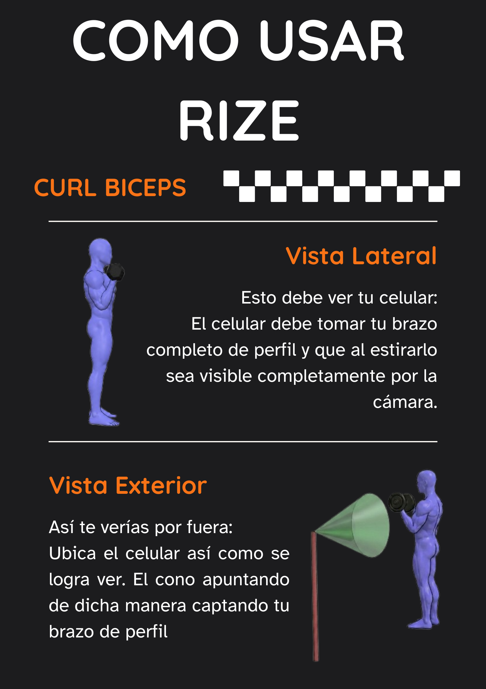

Desarrollo e Implementación de un Sistema de Retroalimentación

en Tiempo Real para la Prevención de Lesiones en el Entrenamiento de Fuerza

**Manual de Usuario**

Versión 1.0

Juan Camilo Mesa Calderón

Michael Bohorquez Mahecha

Simón Alejandro Sanmiguel Ordóñez

Director: Ing. Rubén Darío Hernández Beleño

Universidad Piloto de Colombia

Facultad de Ingeniería - Programa de Ingeniería de Sistemas

Bogotá, D.C., 2026

**Control de Versiones**

| **Versión** | **Fecha** | **Descripción** | **Autores** |
| --- | --- | --- | --- |
| 1.0 | Mayo 2026 | Versión inicial del Manual de Usuario | Michael Bohorquez Mahecha: michael-bohorquez1@upc.edu.co  Simon Sanmiguel Ordoñez: simon-sanmiguel@upc.edu.co  Juan Camilo Mesa Calderon: juan-mesa2@upc.edu.co |

## Contenido

- [1. Objetivo del Manual](#1-objetivo-del-manual)
- [2. Alcance](#2-alcance)
- [3. Términos y Definiciones](#3-términos-y-definiciones)
- [4. Introducción al Sistema RIZE](#4-introducción-al-sistema-rize)
- [5. Objetivo del Sistema RIZE](#5-objetivo-del-sistema-rize)
  - [5.1 Introducción](#51-introducción)
  - [5.2 Alcance Funcional y Organizacional](#52-alcance-funcional-y-organizacional)
    - [5.2.1 Alcance Funcional](#521-alcance-funcional)
    - [5.2.2 Alcance](#522-alcance)
- [6. Funciones y Utilización del Sistema](#6-funciones-y-utilización-del-sistema)
  - [6.1 Prerrequisitos para el Uso del Sistema](#61-prerrequisitos-para-el-uso-del-sistema)
    - [6.1.1 Requisitos de Hardware](#611-requisitos-de-hardware)
    - [6.1.2 Requisitos de Software](#612-requisitos-de-software)
    - [6.1.3 Condiciones de Uso Recomendadas](#613-condiciones-de-uso-recomendadas)
  - [6.2 Configuración del Sistema](#62-configuración-del-sistema)
  - [6.3 Funcionalidades y Servicios Ofrecidos](#63-funcionalidades-y-servicios-ofrecidos)
  - [6.4 Paso a Paso de Cada Opción del Sistema](#64-paso-a-paso-de-cada-opción-del-sistema)
    - [6.4.1 Pantalla de Inicio y Selección de Ejercicio](#641-pantalla-de-inicio-y-selección-de-ejercicio)
    - [6.4.2 Posicionamiento de la Cámara por Ejercicio](#642-posicionamiento-de-la-cámara-por-ejercicio)
    - [6.4.3 Pantalla de Análisis en Tiempo Real](#643-pantalla-de-análisis-en-tiempo-real)
    - [6.4.4 Sistema de Alertas e Interpretación](#644-sistema-de-alertas-e-interpretación)
    - [6.4.5 Revisión del Histórico de Sesión](#645-revisión-del-histórico-de-sesión)
  - [6.5 Preguntas Frecuentes](#65-preguntas-frecuentes)
  - [6.6 Solución de Problemas](#66-solución-de-problemas)
  - [6.7 Datos de Contacto](#67-datos-de-contacto)

# 1. Objetivo del Manual

El presente Manual de Usuario tiene como objetivo orientar a los usuarios finales de la aplicación RIZE sobre las funcionalidades, módulos y procedimientos de operación del sistema, de modo que puedan aprovechar de forma segura y efectiva la retroalimentación biomecánica en tiempo real ofrecida por la aplicación durante el entrenamiento de fuerza.

# 2. Alcance

Este documento describe el contenido operativo mínimo para el uso correcto de la aplicación móvil RIZE en dispositivos Android. Cubre la instalación, configuración inicial, uso de cada módulo de análisis biomecánico y la interpretación de las alertas generadas por el sistema. Está dirigido tanto a usuarios finales (practicantes de entrenamiento de fuerza) como a entrenadores personales y profesionales de las ciencias del deporte que empleen RIZE como herramienta de apoyo.

# 3. Términos y Definiciones

Los siguientes términos y acrónimos son utilizados a lo largo de este documento:

| **Término / Acrónimo** | **Definición** |
| --- | --- |
| RIZE | Sistema de retroalimentación biomecánica en tiempo real para la prevención de lesiones en el entrenamiento de fuerza. |
| MediaPipe | Framework de código abierto de Google que provee el modelo de estimación de pose BlazePose, utilizado por RIZE para identificar 33 puntos clave del cuerpo humano en cada fotograma de video. |
| Pose Landmarker | Módulo de MediaPipe que detecta y rastrea los landmarks corporales en coordenadas 2D normalizadas y 3D del mundo real. |
| Landmark | Punto clave anatómico del cuerpo humano (hombro, codo, muñeca, cadera, rodilla, tobillo, entre otros) detectado por el modelo de pose. |
| Cinemática articular | Estudio del movimiento de las articulaciones sin considerar las fuerzas que lo producen; incluye ángulos, velocidades y aceleraciones angulares. |
| ROM (Range of Motion) | Rango de movimiento. Amplitud angular recorrida por una articulación durante la ejecución de un ejercicio, expresada en grados (°). |
| CVT | Coeficiente de Variación Técnica. Métrica que cuantifica la inestabilidad articular entre repeticiones consecutivas de una misma serie. |
| Fatiga técnica | Degradación progresiva de la calidad del movimiento durante una serie, detectada mediante la reducción de velocidad angular y el aumento de variabilidad articular. |
| Sticking point | Zona crítica dentro del rango de movimiento donde la velocidad de ejecución disminuye marcadamente por desventaja mecánica articular. |
| CameraX | Biblioteca de Jetpack para Android utilizada por RIZE para gestionar el acceso a la cámara del dispositivo y alimentar el pipeline de inferencia. |
| APK | Formato de archivo de instalación de aplicaciones para el sistema operativo Android (.apk). |

# 4. Introducción al Sistema RIZE

RIZE es una aplicación móvil para Android desarrollada como proyecto de grado en la Universidad Piloto de Colombia, Programa de Ingeniería de Sistemas. El sistema utiliza visión por computadora y aprendizaje automático para analizar la técnica de ejecución de ejercicios de fuerza en tiempo real, sin requerir dispositivos de hardware adicionales más allá de un smartphone con cámara.

La aplicación emplea el modelo de estimación de pose MediaPipe Pose Landmarker, basado en la arquitectura BlazePose de Google, para detectar 33 puntos clave del cuerpo humano en coordenadas tridimensionales a partir del video capturado por la cámara del dispositivo. Sobre estos landmarks, algoritmos biomecánicos codificados en Kotlin calculan ángulos articulares, velocidades angulares y métricas de variabilidad, que son comparados con umbrales derivados de la literatura científica especializada en biomecánica del ejercicio.

En su versión actual, RIZE analiza tres ejercicios multiarticulares fundamentales:

* Press de banca (Bench Press)
* Curl de bíceps (Bicep Curl)
* Sentadilla (Back Squat)

El sistema genera alertas en tiempo real clasificadas en tres niveles de prioridad , corrección crítica de seguridad, corrección postural y detección preventiva de fatiga técnica, y mantiene un registro de sesión con todas las detecciones para revisión al finalizar la serie.

# 5. Objetivo del Sistema RIZE

## 5.1 Introducción

RIZE surgió de la necesidad de ofrecer retroalimentación técnica objetiva e inmediata a practicantes de entrenamiento de fuerza que carecen de supervisión profesional constante. Los errores técnicos en ejercicios como la sentadilla, el press de banca o el curl de bíceps generan cargas inapropiadas sobre articulaciones y tejidos blandos, constituyendo una de las principales causas de lesión en gimnasios y entornos de entrenamiento doméstico.

El sistema actúa como herramienta de evaluación biomecánica que, a través de la cámara del smartphone, procesa cada fotograma del video en tiempo real para determinar si la ejecución del movimiento cumple con los criterios cinemáticos de seguridad. Cuando detecta una desviación respecto a los umbrales definidos, emite una alerta categorizada para que el usuario pueda corregir la técnica o detener la serie antes de que ocurra un fallo neuromotor.

## 5.2 Alcance Funcional y Organizacional

### 5.2.1 Alcance Funcional

Desde el punto de vista funcional, RIZE ofrece las siguientes capacidades principales:

* Detección y rastreo en tiempo real de 33 landmarks corporales mediante MediaPipe Pose Landmarker.
* Cálculo fotograma a fotograma de ángulos articulares, velocidades angulares y aceleraciones para los ejercicios soportados.
* Conteo automático de repeticiones y segmentación de fases (excéntrica y concéntrica) dentro de cada serie.
* Evaluación de corrección postural con umbrales fijos respaldados por evidencia científica.
* Detección de fatiga técnica mediante seguimiento de la degradación de velocidad angular entre repeticiones consecutivas.
* Sistema de alertas jerarquizado con tres niveles de severidad: crítico, postural y preventivo.
* Registro de histórico de sesión con todas las detecciones para revisión al finalizar la serie.

### 5.2.2 Alcance

RIZE está dirigido principalmente a los siguientes grupos de usuarios:

* Practicantes de gimnasio de nivel principiante e intermedio que entrenan sin entrenador personal.
* Entrenadores personales que buscan una herramienta objetiva de apoyo para la corrección técnica de sus alumnos.
* Investigadores y profesionales de las ciencias del deporte interesados en el análisis cinemático mediante visión artificial.
* Fisioterapeutas en procesos de rehabilitación que involucren ejercicios de fuerza controlados.

# 6. Funciones y Utilización del Sistema

## 6.1 Prerrequisitos para el Uso del Sistema

### 6.1.1 Requisitos de Hardware

La tabla 1 resume los requerimientos mínimos y recomendados de hardware para la correcta ejecución de RIZE en un dispositivo Android.

| **Componente** | **Mínimo recomendado** | **Configuración óptima** |
| --- | --- | --- |
| Procesador | Octa-core 2.2 GHz (MediaTek Helio P95) | Octa-core 2.8 GHz (Snapdragon 6875) |
| Memoria RAM | 6 GB | 8 GB o más |
| Cámara trasera/delantera | 12 MP / 8 MP | 108 MP / 16 MP |
| Soporte para GPU | Integrada | Integrada |

Tabla 1. Requisitos mínimos y recomendados de hardware

Estos requisitos fueron extraídos de los dispositivos sobre los que se hicieron pruebas de rendimiento. Los modelos de dispositivos fueron: para el mínimo recomendado OPPO Reno 5 lite. Para la configuración optima Xiomi Redmi Note 13.

### 6.1.2 Requisitos de Software

* Sistema operativo: Android 8.0 (API nivel 26) o superior.
* Permiso obligatorio: acceso a la cámara del dispositivo.
* El análisis biomecánico no requiere conexión a internet; el procesamiento se ejecuta completamente en el dispositivo.

### 6.1.3 Condiciones de Uso Recomendadas

Para garantizar la precisión del análisis biomecánico, se recomienda tener en cuenta las siguientes condiciones durante el uso de la aplicación:

* Iluminación: ambiente bien iluminado con luz natural o artificial difusa. Se deben evitar condiciones de contraluz o sombras pronunciadas sobre el cuerpo del usuario.
* Vestimenta: ropa ajustada al cuerpo (licra, mallas o camiseta entallada). La ropa holgada puede dificultar la detección precisa de los landmarks corporales.
* Encuadre: el cuerpo completo del usuario debe mantenerse visible en el cuadro de la cámara durante toda la ejecución del ejercicio.
* Presencia en escena: el modelo está optimizado para un único sujeto. La presencia de otras personas en el encuadre puede generar detecciones incorrectas.
* Soporte para el dispositivo: se recomienda utilizar un trípode, soporte de escritorio o apoyar el smartphone sobre una superficie estable para mantener un encuadre fijo durante la sesión.

## 6.2 Configuración del Sistema

Los siguientes son el paso a paso para la instalación y configuración inicial de la app.

1. Descargue el archivo RIZE.apk desde el repositorio.
2. En el dispositivo Android, diríjase a Ajustes > Seguridad (o Privacidad) y habilite la opción Instalar aplicaciones de fuentes desconocidas para el gestor de archivos que utilizará para abrir el APK.
3. Abra el archivo RIZE.apk desde el gestor de archivos del dispositivo y confirme la instalación cuando el sistema lo solicite.
4. Una vez completada la instalación, abra RIZE desde el menú de aplicaciones.
5. En el primer inicio de algún ejercicio, el sistema solicitará permiso de acceso a la cámara. Es necesario conceder dicho permiso para que la aplicación pueda funcionar correctamente.

## 6.3 Funcionalidades y Servicios Ofrecidos

La tabla 2 resume los módulos funcionales de RIZE, la función que realizan y el perfil de usuario al que están dirigidos.

| **Módulo / Funcionalidad** | **Descripción** | **Acceso** |
| --- | --- | --- |
| Selección de ejercicio | Permite elegir entre Press de banca, Curl de bíceps y Sentadilla antes de iniciar una sesión de análisis. | Todos los usuarios |
| Análisis en tiempo real | Activa la cámara y ejecuta el pipeline de detección de pose y evaluación biomecánica fotograma a fotograma. | Todos los usuarios |
| Superposición de esqueleto | Renderiza sobre el video en vivo los 33 landmarks y las conexiones óseas detectadas por MediaPipe, confirmando visualmente la calidad de la detección. | Todos los usuarios |
| Conteo de repeticiones | Segmenta y cuenta automáticamente cada repetición completa a partir de la trayectoria del punto articular principal del ejercicio activo. | Todos los usuarios |
| Alertas de corrección postural | Emite alertas cuando el ángulo articular excede los umbrales biomecánicos de seguridad definidos para el ejercicio en curso. | Todos los usuarios |
| Detección de fatiga técnica | Monitoriza la degradación progresiva de la velocidad angular y la variabilidad articular entre repeticiones consecutivas de una misma serie. | Todos los usuarios |
| Histórico de sesión | Registra todas las alertas y métricas calculadas durante la serie para revisión al finalizar la misma. | Todos los usuarios |

Tabla 2. Módulos funcionales de RIZE

## 6.4 Paso a Paso de Cada Opción del Sistema

### 6.4.1 Pantalla de Inicio y Selección de Ejercicio

Al abrir RIZE, se presenta la pantalla principal con la lista de ejercicios disponibles para análisis. El flujo de inicio es el siguiente:

1. Abra la aplicación RIZE en su dispositivo Android.
2. Seleccione el botón de comenzar al final del home o el botón de “+” en la parte central de la navigation bar inferior.
3. Seleccione el ejercicio que va a realizar tocando su nombre en la lista: Press de banca, Curl de bíceps o Sentadilla.
4. Lea las instrucciones de posicionamiento de cámara específicas del ejercicio seleccionado.
5. Posicione el smartphone según las indicaciones y comience la sesión.

### 6.4.2 Posicionamiento de la Cámara por Ejercicio

El posicionamiento correcto de la cámara es determinante para la precisión del análisis. Las siguientes infografías explican de manera visual estas indicaciones.

*Figura 1. Infografía explicativa press de banca.*

*Figura 2. Infografía explicativa sentadilla.*

*Figura 3. Infografía explicativa curl de bíceps.*

### 6.4.3 Pantalla de Análisis en Tiempo Real

Durante el análisis, la pantalla muestra los siguientes elementos superpuestos sobre el video en vivo de la cámara:

* Esqueleto en tiempo real: puntos clave conectados mediante líneas que confirman la correcta detección del cuerpo.
* Contador de repeticiones: número de repeticiones válidas completadas en la serie actual.
* Ángulo articular principal: valor numérico del ángulo articular más relevante para el ejercicio activo (codo en curl de bíceps y press de banca; rodilla en sentadilla), actualizado en tiempo real.
* Indicador de fatiga: porcentaje de degradación de velocidad angular acumulada respecto a las primeras repeticiones de referencia.
* Panel de alertas: muestra la alerta activa de mayor jerarquía cuando se supera algún umbral biomecánico.

### 6.4.4 Sistema de Alertas e Interpretación

RIZE clasifica las alertas en tres niveles de jerarquía. Cuando varias alertas se activan simultáneamente, el sistema muestra únicamente la de mayor severidad en pantalla, pero registra todas las detecciones en el histórico de la sesión para su revisión posterior.

* Nivel 1: Alerta crítica de seguridad: indica una condición de riesgo inminente de lesión. Se recomienda detener la serie de forma inmediata.
* Nivel 2: Alerta de corrección postural: indica una desviación técnica que puede corregirse sin necesidad de detener la serie. Se recomienda ajustar la postura en la siguiente repetición.
* Nivel 3: Alerta preventiva de fatiga técnica: indica degradación progresiva de la calidad del movimiento. Se recomienda finalizar la serie de forma voluntaria antes del colapso neuromotor.

### 6.4.5 Revisión del Histórico de Sesión

Al finalizar la serie o al detener el análisis, la aplicación presenta un resumen con la siguiente información:

* Número total de repeticiones completadas en la serie.
* Lista de alertas registradas, indicando el tipo de alerta, el número de repetición en que ocurrió y la variable que superó el umbral.
* Recomendaciones de acuerdo con lo detectado en la sesión.

## 6.5 Preguntas Frecuentes

* ¿Qué información proporciona RIZE al usuario?

RIZE permite identificar en tiempo real si la técnica de ejecución cumple con los criterios biomecánicos de seguridad, cuántas repeticiones se completaron en la serie y en qué momento comenzó a degradarse la calidad del movimiento. Con dicha información el usuario puede ajustar la carga, el número de repeticiones o la técnica para entrenar de forma más segura y efectiva.

* ¿Las métricas de RIZE reemplazan la evaluación de un profesional del deporte?

No. RIZE es una herramienta de apoyo tecnológico que ofrece retroalimentación objetiva basada en criterios cinemáticos. No reemplaza la evaluación integral de un profesional certificado, quien considera factores adicionales como la historia clínica, la condición muscular, la flexibilidad y el contexto del programa de entrenamiento.

* ¿Qué significa fatiga técnica en el contexto de RIZE?

La fatiga técnica es la degradación progresiva de la calidad del movimiento durante una serie de ejercicio. RIZE la detecta cuando la velocidad angular promedio de la fase concéntrica cae más de un 20–25% respecto a la velocidad de referencia establecida durante las primeras repeticiones. Esto indica que el sistema neuromuscular está comprometido y que continuar la serie incrementa el riesgo de lesión.

* ¿Qué es el sticking point y por qué es relevante?

Es la zona del rango de movimiento donde la velocidad de ejecución disminuye temporalmente por desventaja mecánica articular. En el press de banca, RIZE emite una alerta cuando la duración de esta fase supera los 870 ms, lo que indica que el ejecutante está próximo a su límite de capacidad neuromotora.

* ¿Cuándo se debe detener la serie ante una alerta?

Ante una alerta crítica, se debe detener la serie de forma inmediata y revisar la técnica antes de continuar. Ante una alerta postural, se debe intentar corregir el error en la siguiente repetición; si el error persiste, se recomienda finalizar la serie. Ante una alerta de fatiga técnica, se debe evaluar si es posible completar una o dos repeticiones más con buena técnica, de lo contrario, se debe finalizar la serie de forma voluntaria.

## 6.6 Solución de Problemas

La tabla 3 describe los inconvenientes más frecuentes que puede enfrentar el usuario, sus posibles causas y las soluciones recomendadas.

| **Problema** | **Posible causa** | **Solución recomendada** |
| --- | --- | --- |
| La cámara no se activa al iniciar el análisis | Permiso de cámara no concedido | Dirigirse a Ajustes > Aplicaciones > RIZE > Permisos y habilitar el acceso a la cámara. |
| El esqueleto no aparece o se muestra inestable | Iluminación insuficiente, ropa holgada o más de una persona en el encuadre | Mejorar la iluminación, usar ropa ajustada y asegurarse de ser la única persona visible en la cámara. |
| La aplicación presenta lag o fotogramas lentos | Recursos del dispositivo insuficientes (RAM o GPU) | Cerrar otras aplicaciones en segundo plano. En dispositivos de gama baja, el modelo opera en CPU con menor velocidad de fotogramas. |
| Las repeticiones no se cuentan correctamente | Movimiento parcial, velocidad muy baja o encuadre incompleto | Completar el ROM completo en cada repetición. |
| Se emiten alertas posturales sin error aparente | Encuadre incorrecto o cámara no perpendicular al plano del ejercicio | Reposicionar la cámara según las indicaciones de la sección 6.4.2. |
| La aplicación no se instala desde el APK | Instalación de fuentes desconocidas no habilitada | Habilitar la instalación de fuentes desconocidas en Ajustes > Seguridad del dispositivo. |

Tabla 3. Problemas frecuentes y soluciones recomendadas

## 6.7 Datos de Contacto

Para reportar errores, solicitar soporte técnico o funcional, o para consultas relacionadas con el proyecto de investigación, puede comunicarse con los autores a través de los siguientes canales institucionales:

| **Canal** | **Información** |
| --- | --- |
| Institución | Universidad Piloto de Colombia, Facultad de Ingeniería, Programa de Ingeniería de Sistemas |
| Director del proyecto | Ing. Rubén Darío Hernández Beleño |
| Autores | Michael Bohorquez Mahecha: michael-bohorquez1@upc.edu.co  Simon Sanmiguel Ordoñez: simon-sanmiguel@upc.edu.co  Juan Camilo Mesa Calderon: juan-mesa2@upc.edu.co |

Tabla 4. Datos de contacto.